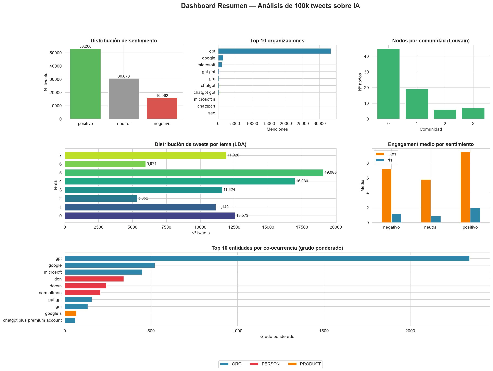
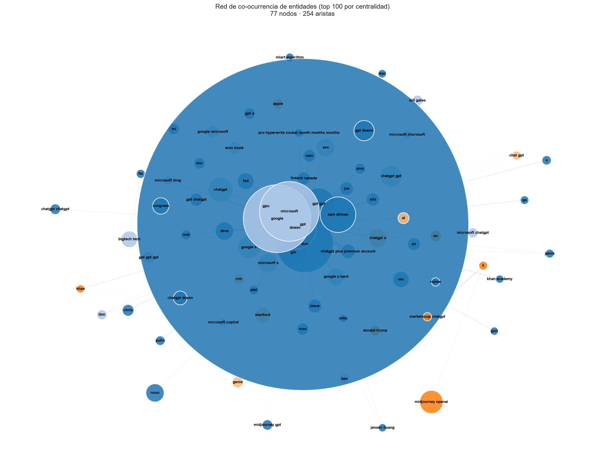

# 🧠 Reto 7 — Análisis de Datos No Estructurados y Redes Sociales

[](https://www.python.org/)
[](https://www.nltk.org/)
[](https://spacy.io/)
[](https://textblob.readthedocs.io/)
[](https://scikit-learn.org/)
[](https://networkx.org/)
[](https://matplotlib.org/)
[](https://seaborn.pydata.org/)
[](LICENSE)
[]()

> **Curso:** Business Intelligence y Big Data (Curso 6) | Odisea Data
> **Reto:** 7 — Análisis de Datos No Estructurados
> **Autor:** Judit Giravent Pineda

Análisis completo de **100.000 tweets sobre inteligencia artificial** mediante técnicas de NLP, análisis de sentimiento, extracción de entidades, modelado de tópicos y análisis de redes de co-ocurrencia.

---

## 📊 Hallazgos principales

| Métrica | Resultado |
|---|---|
| **Tweets analizados** | 100.000 |
| **Usuarios únicos** | 63.418 |
| **Sentimiento positivo** | 53,26% |
| **Sentimiento negativo** | 16,06% |
| **Compound medio (VADER)** | +0,2174 |
| **Entidades extraídas** | 64.268 (10.718 únicas) |
| **Temas detectados (LDA)** | 8 |
| **Comunidades en la red** | 4 |

**Conclusión principal**: el discurso público sobre IA en marzo de 2023 es **marcadamente positivo**, con **ChatGPT/OpenAI como hub absoluto** (grado ponderado 2.344, 4,5× el siguiente nodo). Google Bard, Microsoft Bing y el ecosistema cripto-IA forman comunidades satélite con dinámicas propias.

---

## 🗂️ Estructura del proyecto

```
reto7_Analisis_datos_no_estructurados/
│
├── data/
│   ├── raw/
│   │   └── tweets/
│   │       ├── ai_tweet.csv
│   │       ├── Twitter Jan Mar.csv
│   │       └── sentiment/file.csv
│   └── processed/                # Datasets intermedios
│       ├── tweets_ia_raw_*.csv
│       ├── tweets_limpios_*.csv
│       ├── tweets_nlp_*.csv
│       ├── tweets_con_sentimiento_*.csv
│       ├── tweets_entidades_*.csv
│       ├── tweets_topicos_*.csv
│       ├── lda_temas_*.csv
│       ├── red_entidades_nodos_*.csv
│       ├── red_entidades_aristas_*.csv
│       ├── red_entidades_comunidades_*.csv
│       └── red_entidades_*.gexf
│
├── notebooks/                    # Pipeline completo
│   ├── 01_extraccion_tweets.ipynb
│   ├── 02_preparacion_datos.ipynb
│   ├── 03_eda_visualizacion.ipynb
│   ├── 04_nlp_sentimientos.ipynb
│   ├── 05_ner_lda.ipynb
│   ├── 06_analisis_redes.ipynb
│   └── 07_interpretacion_recomendaciones.ipynb
│
├── src/                          # Código reutilizable
│   ├── __init__.py
│   ├── extraccion/
│   ├── preparacion/
│   ├── analisis/
│   └── utilidades/
│
├── outputs/
│   ├── figuras/                  # 25+ visualizaciones PNG
│   ├── modelos/
│   └── reportes/                 # Reportes intermedios
│
├── docs/
│   ├── informe_analisis.md       # Informe completo
│   ├── recomendaciones.md        # 17 recomendaciones estratégicas
│   ├── metodologia.md            # Pipeline detallado
│   └── seleccion_fuentes.md      # Justificación de fuentes
│
├── tests/
├── requirements.txt
├── .gitignore
└── README.md
```

---

## 🚀 Cómo ejecutar el proyecto

### Requisitos previos

- **Python**: 3.10+ (probado con 3.13.7)
- **Sistema**: Windows, macOS o Linux
- **RAM**: 8 GB mínimo, 16 GB recomendado
- **Disco**: 2 GB libres

### Instalación

```bash
# 1. Clonar el repositorio
git clone https://github.com/jdthgp27/reto7_Analisis_datos_no_estructurados.git
cd reto7_Analisis_datos_no_estructurados

# 2. Crear entorno virtual
python -m venv venv
source venv/Scripts/activate    # Windows (Git Bash)
# source venv/bin/activate      # macOS/Linux

# 3. Instalar dependencias
pip install -r requirements.txt
python -m spacy download en_core_web_sm
python -m spacy download es_core_news_sm
```

### Ejecución

```bash
# Iniciar Jupyter
jupyter notebook

# Ejecutar notebooks en orden: 01 → 02 → 03 → 04 → 05 → 06 → 07
```

**Tiempo total estimado**: ~40-55 minutos.

---

## 📁 Datos de entrada

Los datasets originales están disponibles en **Kaggle**:

| Dataset | Fuente | Registros |
|---|---|---|
| Tweets sobre ChatGPT | [kaggle.com/datasets/khalidryder777/500k-chatgpt-tweets-jan-mar-2023](https://www.kaggle.com/datasets/khalidryder777/500k-chatgpt-tweets-jan-mar-2023) | 500.036 |
| Tweets etiquetados | [kaggle.com/datasets/charunisa/chatgpt-sentiment-analysis](https://www.kaggle.com/datasets/charunisa/chatgpt-sentiment-analysis) | 219.294 |
| Tweets geolocalizados | Kaggle (AI Tweet Dataset) | 5.002 |

> ⚠️ **Importante**: los archivos CSV originales **no se incluyen** en el repositorio por tamaño (>100 MB). Descárgalos de Kaggle y colócalos en `data/raw/tweets/`.

---

## 🔬 Pipeline técnico

| Fase | Técnica | Herramientas | Output |
|---|---|---|---|
| **1. Extracción** | Carga y validación | pandas | `tweets_ia_raw_*.csv` |
| **2. Preparación** | Limpieza + tokenización + lematización | spaCy, NLTK | `tweets_nlp_*.csv` |
| **3. EDA** | Análisis exploratorio | Matplotlib, Seaborn | 9 figuras |
| **4. Sentimiento** | VADER + TextBlob | NLTK, TextBlob | `tweets_con_sentimiento_*.csv` |
| **5. NER + Tópicos** | spaCy + LDA | spaCy, scikit-learn | `tweets_entidades_*.csv`, `lda_temas_*.csv` |
| **6. Redes** | Co-ocurrencia + Louvain | NetworkX, python-louvain | `red_entidades_*.csv`, `*.gexf` |

**Documentación completa**: [docs/metodologia.md](docs/metodologia.md)

---

## 📈 Visualizaciones destacadas

| Figura | Descripción |
|---|---|
| `03_top_30_palabras.png` | Palabras más frecuentes |
| `03_wordcloud_chatgpt.png` | Nube de palabras |
| `04_distribucion_sentimiento.png` | Distribución VADER vs TextBlob |
| `04_sentimiento_temporal.png` | Evolución del sentimiento |
| `05_top_entidades_por_tipo.png` | Top entidades (ORG, PERSON, PRODUCT) |
| `05_lda_pesos_temas.png` | Pesos por tema LDA |
| `06_red_entidades.png` | Red de co-ocurrencia |
| `07_dashboard_resumen.png` | Dashboard ejecutivo |

### Dashboard ejecutivo



### Red de co-ocurrencia de entidades



### Nube de palabras


---

## 📚 Documentación

| Documento | Contenido |
|---|---|
| [docs/informe_analisis.md](docs/informe_analisis.md) | Informe completo (12 secciones) |
| [docs/recomendaciones.md](docs/recomendaciones.md) | 17 recomendaciones estratégicas priorizadas |
| [docs/metodologia.md](docs/metodologia.md) | Pipeline técnico detallado |
| [docs/seleccion_fuentes.md](docs/seleccion_fuentes.md) | Criterios de selección de fuentes |

---

## ⚠️ Limitaciones conocidas

1. **Sesgo temporal**: el corpus efectivo cubre solo **14 días** (16-29 marzo 2023), no los 3 meses originales. Se debe al muestreo `df.head(100_000)` sobre un CSV ordenado descendentemente.
2. **Ruido en NER**: spaCy generó falsos positivos (`don`, `doesn`, `gpt gpt`).
3. **Desequilibrio lingüístico**: 99,77% inglés, 0,23% español.
4. **Red de co-ocurrencia**: refleja proximidad temática, **no** interacciones reales.

> Detalle completo en [docs/informe_analisis.md](docs/informe_analisis.md) (sección 10).

---

## 🛠️ Stack tecnológico

<p align="center">
  
  
  
  
  
  
  
  
  
</p>

| Categoría | Herramientas |
|---|---|
| **Datos** | pandas, NumPy |
| **NLP** | NLTK, spaCy, TextBlob |
| **ML** | scikit-learn (LDA) |
| **Redes** | NetworkX, python-louvain |
| **Visualización** | Matplotlib, Seaborn, WordCloud |

---

## 📜 Licencia

Este proyecto es de **uso educativo**. Los datasets originales pertenecen a sus autores en Kaggle (licencia **CC-BY**).

---

## 🙏 Agradecimientos

- [Kaggle](https://www.kaggle.com/) y los autores de los datasets utilizados.
- [Odisea Data](https://odiseadata.com/) por el diseño del reto.
- Librerías open-source que hacen posible el análisis.

---

## 📧 Contacto

**Judit Giravent Pineda**

- GitHub: [@jdthgp27](https://github.com/jdthgp27)
- LinkedIn: [linkedin.com/in/judit-giravent-27b167156](https://linkedin.com/in/judit-giravent-27b167156)
- Email: jdthgp27@gmail.com

---

⭐ Si este proyecto te ha resultado útil, considera darle una estrella en GitHub.